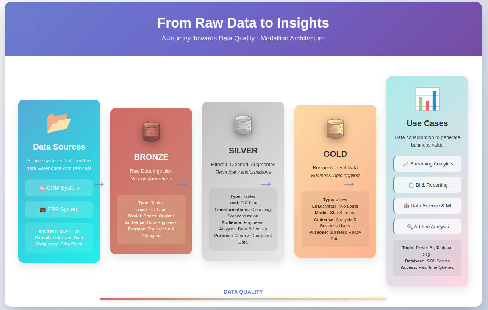
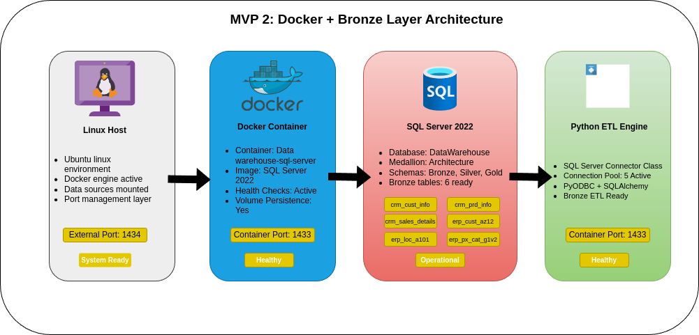
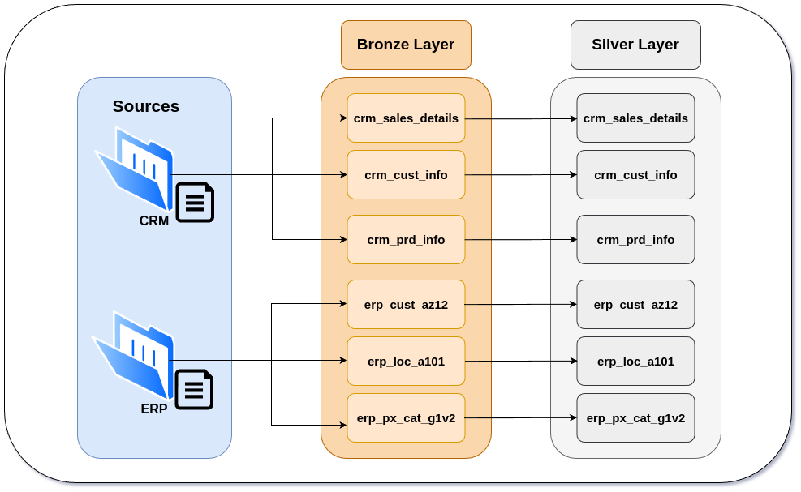
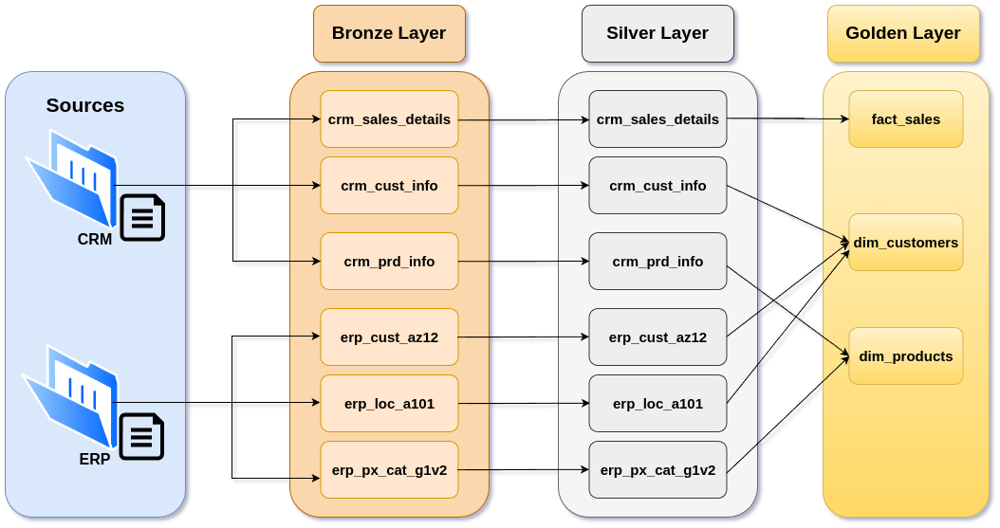
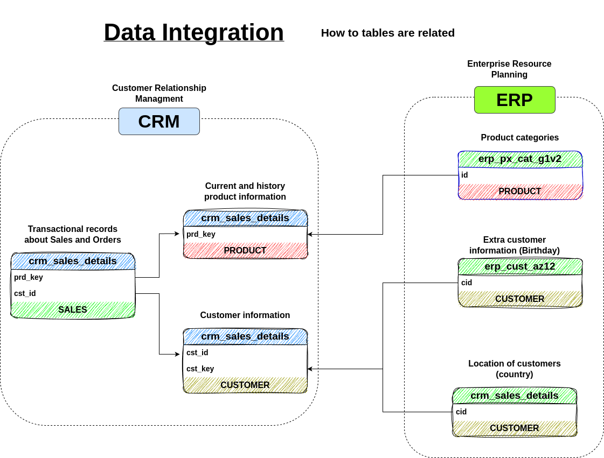

# Modern Data Warehouse with SQL Server & Medallion Architecture


## 🏗️ Project Overview

Production-ready Data Warehouse implementation demonstrating **systematic Data Engineering problem-solving** through iterative architecture evolution. This project showcases real-world troubleshooting, infrastructure decision-making, and technical adaptability required in production environments.

## 📊 Architecture & Implementation

### Overall Data Warehouse Design

*Conceptual view of the complete Medallion Architecture with Bronze, Silver, and Gold layers, illustrating the data flow from source systems to analytical consumption. The design supports scalable data processing with clear separation of concerns.*

### Current Docker Infrastructure & Components

*Detailed technical architecture showing the containerized SQL Server 2022 environment, Python ETL Engine integration, and port mapping strategy (1434:1433) for local development. Each component displays real-time health status and connectivity.*

### Bronze to Silver Data Flow

*Data flow mapping between Bronze and Silver layers showcasing the 6 core tables: 3 from CRM system (sales_details, cust_info, prd_info) and 3 from ERP system (cust_az12, loc_a101, px_cat_g1v2). Arrows indicate transformation pipelines.*

### Complete ETL Pipeline Process

*End-to-end ETL pipeline demonstrating data transformations, validations, and quality checks at each layer. Includes error handling paths and data lineage tracking from raw ingestion to analytics-ready datasets.*

### Data Integration & Table Relationships

*Entity relationship model showing how CRM and ERP data sources integrate to create a unified business view. Highlights key relationships between customers, products, locations, and sales transactions.*

## 🏛️ Architecture Deep Dive

### Infrastructure Components

#### Docker Container Environment
- **Container**: SQL Server 2022 Enterprise Edition
  - **External Port**: 1434 (avoiding local SQL Server conflicts)
  - **Internal Port**: 1433 (standard SQL Server port)
  - **Health Checks**: Automated monitoring with 30-second intervals
  - **Volume Persistence**: Mounted volumes for data and SQL scripts
  - **Resource Allocation**: 4GB memory minimum for optimal performance

#### Python ETL Engine
- **Connection Pool**: SQLAlchemy with 5 active connections
- **Direct Execution**: PyODBC for DDL operations
- **Error Handling**: Retry logic with exponential backoff
- **Logging**: Structured logs with Loguru for observability

### Data Layers Technical Specifications

#### 🥉 Bronze Layer (Raw Data Preservation)
- **Purpose**: Immutable raw data storage maintaining source system format
- **Tables**: 6 tables preserving original schema and data types
  - CRM Tables: `crm_sales_details`, `crm_cust_info`, `crm_prd_info`
  - ERP Tables: `erp_cust_az12`, `erp_loc_a101`, `erp_px_cat_g1v2`
- **Key Features**:
  - No transformations applied - preserving data lineage
  - Audit columns: `load_timestamp`, `source_system`, `batch_id`
  - BULK INSERT operations for high-performance loading
  - Supports incremental and full refresh patterns

#### 🥈 Silver Layer (Enterprise Data Standards)
- **Purpose**: Cleaned, standardized, and validated data
- **Transformations Applied**:
  - Data type standardization (VARCHAR collations, DATE formats)
  - NULL handling with business logic defaults
  - Duplicate detection and resolution
  - Referential integrity validation
- **Data Quality Framework**:
  - Column-level validations (data types, ranges, patterns)
  - Row-level validations (business rules, constraints)
  - Cross-table validations (referential integrity)
  - Quality metrics tracking and reporting

#### 🥇 Gold Layer (Analytics-Optimized) [Planned]
- **Purpose**: Business-optimized dimensional models
- **Design Pattern**: Star Schema with fact and dimension tables
- **Planned Components**:
  - Fact Tables: `fact_sales` with aggregated metrics
  - Dimensions: `dim_customer`, `dim_product`, `dim_location`, `dim_date`
  - Slowly Changing Dimensions (SCD) Type 2 for history tracking
  - Pre-aggregated views for common analytics queries

### Data Flow Technical Details

#### Ingestion Process (Source → Bronze)
```
1. Source Detection: Automated file discovery in /data directory
2. Schema Validation: Verify CSV structure matches expected format
3. Bulk Loading: SQL Server BULK INSERT with error file generation
4. Audit Trail: Capture row counts, load times, and source metadata
5. Error Handling: Failed records logged to error tables for review
```

#### Transformation Pipeline (Bronze → Silver)
```
1. Data Profiling: Analyze source data quality and patterns
2. Cleansing Rules: Apply standardization and cleaning logic
3. Validation Checks: Execute comprehensive quality rules
4. Load Strategy: Merge operations for incremental updates
5. Metrics Collection: Capture transformation statistics
```

## 🎯 Technical Evolution & Problem-Solving Journey

### Architecture Iteration Process

```
Initial Challenge → Technical Analysis → Solution Implementation → Validation
      ↓                    ↓                      ↓                ↓
  Port Conflicts    →  Docker Diagnostics  →  Port Strategy  →  Health Checks
  SQL Execution     →  SQLAlchemy Analysis →  PyODBC Switch  →  Script Success
  Integration       →  Connection Testing  →  Robust Design  →  End-to-End
```

### 🔧 Critical Technical Challenges Overcome

#### Challenge 1: Infrastructure Port Conflicts
**Problem:** Docker SQL Server conflicting with local installation on port 1433
```bash
# Error Encountered
Error: Bind for 0.0.0.0:1433 failed: port is already allocated
```

**Technical Analysis:** Used Docker logs and netstat to diagnose port allocation conflicts

**Solution Implemented:**
```yaml
# Before: Standard port mapping
ports:
  - "1433:1433"

# After: Strategic port isolation
ports:
  - "1434:1433"  # External 1434 → Internal 1433
```
**Business Impact:** Enables multiple SQL Server environments for development flexibility

#### Challenge 2: SQL Script Execution Engine Limitation
**Problem:** SQLAlchemy failing on complex DDL with conditional logic
```python
# Error Pattern
sqlalchemy.exc.ProgrammingError: There is already an object named 'table' in database
```

**Root Cause Analysis:** SQLAlchemy processing batches individually, losing conditional context

**Technical Solution:**
```python
# Before: SQLAlchemy text() execution
def execute_script(self, script_path: str) -> bool:
    with self.get_connection() as conn:
        conn.execute(text(clean_block))

# After: Direct PyODBC batch execution  
def execute_script(self, script_path: str) -> bool:
    with pyodbc.connect(pyodbc_conn_str) as conn:
        cursor = conn.cursor()
        cursor.execute(clean_batch)  # Maintains full context
```
**Technical Impact:** Enables complex DDL execution matching SQL Server behavior

## 🚀 Technology Stack Demonstrated

### Infrastructure & DevOps
- **Docker Compose**: Multi-service orchestration with health checks
- **SQL Server 2022**: Enterprise database engine in containers
- **Git Workflow**: Feature-based branching with semantic tagging
- **Shell Scripting**: Automation for deployment and operations

### Python Engineering
- **SQLAlchemy**: Connection pooling and ORM capabilities
- **PyODBC**: Direct database protocol for complex operations
- **Loguru**: Structured logging for observability
- **Pydantic**: Data validation and configuration management
- **Pandas**: Data manipulation and transformation [Planned]

### Database Engineering
- **Medallion Architecture**: Bronze-Silver-Gold layered approach
- **Schema Design**: Multi-tenant namespace organization
- **DDL Management**: Complex conditional logic execution
- **Stored Procedures**: Encapsulated business logic
- **Performance Optimization**: Indexing strategies and query tuning

### Data Quality & Validation
- **Framework**: Custom validation engine with configurable rules
- **Metrics**: Row counts, null percentages, pattern matching
- **Monitoring**: Real-time quality dashboards [Planned]
- **Alerting**: Automated notifications for quality issues [Planned]

## 📈 Development Roadmap & Progress

### Completed Milestones
- [x] **Foundation Setup**: Project structure and development environment
- [x] **Docker Infrastructure**: Containerized SQL Server with health monitoring
- [x] **Bronze Layer**: Complete raw data ingestion pipeline
- [x] **Silver Layer**: Data transformation and quality framework
- [x] **ETL Pipeline**: Automated Bronze→Silver data flow
- [x] **Validation Framework**: Comprehensive data quality checks

### Current Development
- [ ] **Gold Layer Design**: Dimensional modeling for analytics
- [ ] **API Development**: FastAPI endpoints for data access
- [ ] **Performance Tuning**: Query optimization and indexing

### Future Enhancements
- [ ] **Real-time Processing**: Stream processing capabilities
- [ ] **Machine Learning**: Predictive analytics integration
- [ ] **Data Catalog**: Automated documentation generation
- [ ] **Monitoring Dashboard**: Grafana integration for metrics

## 🛠️ Quick Start Guide

### Prerequisites
- Docker & Docker Compose (v20.10+)
- Python 3.8+ with pip
- Git
- 8GB RAM minimum (for SQL Server container)

### Environment Setup
```bash
# Clone repository
git clone [repository-url]
cd dwh-portfolio

# Create Python virtual environment
python -m venv venv
source venv/bin/activate  # On Windows: venv\Scripts\activate

# Install dependencies
pip install -r requirements.txt

# Start Docker infrastructure
docker-compose up -d

# Verify container health
docker-compose ps  # Should show "healthy" status
```

### Database Initialization
```bash
# Create database schemas and tables
python scripts/database/create_schemas.py
python scripts/database/create_bronze_tables.py
python scripts/database/create_silver_tables.py

# Load sample data
python run_pipeline.py bronze

# Run transformation pipeline
python run_pipeline.py silver
```

## 🧪 Validation & Testing

### Infrastructure Health Checks
```bash
# Docker container status
docker-compose ps
# Expected: datawarehouse-sql-server (healthy)

# Database connectivity test
python scripts/test_connection.py
# Expected: ✅ Connection successful!

# Pipeline validation
python run_pipeline.py check
# Expected: ✅ All systems operational
```

### Database Validation
Connect using Azure Data Studio or SSMS:
- **Server**: `localhost,1434`
- **Authentication**: SQL Login
- **Username**: `sa`
- **Password**: `MyPass123!`
- **Database**: `DataWarehouse`

### Data Quality Verification
```sql
-- Check Bronze layer record counts
SELECT TABLE_NAME, COUNT(*) as row_count 
FROM bronze.INFORMATION_SCHEMA.TABLES
WHERE TABLE_TYPE = 'BASE TABLE';

-- Verify Silver layer transformations
SELECT * FROM silver.data_quality_metrics
ORDER BY validation_timestamp DESC;
```

## 📚 Technical Learning Outcomes

### Problem-Solving Methodology
- **Systematic Diagnosis**: Using logs, error analysis, and root cause investigation
- **Iterative Solutions**: Evolving architecture based on real constraints
- **Tool Selection**: Choosing appropriate technologies for specific challenges
- **Performance Analysis**: Identifying bottlenecks and optimization opportunities

### Professional Engineering Practices
- **Infrastructure as Code**: Docker Compose for reproducible environments
- **Connection Management**: Robust database connectivity with pooling
- **Version Control**: Git workflow with meaningful commits and semantic tags
- **Code Quality**: Linting, formatting, and type checking standards
- **Documentation**: Comprehensive technical and user documentation

### Data Engineering Competencies
- **Medallion Architecture**: Industry-standard data processing patterns
- **ETL Development**: Scalable pipeline design and implementation
- **Data Quality**: Framework for validation and monitoring
- **Performance Tuning**: Query optimization and resource management
- **Security**: Role-based access control and data governance [Planned]

## 🔗 Project Resources

### Repository Structure
```
dwh-portfolio/
├── 📁 src/              # Source code (ETL, validators, connectors)
├── 📁 sql/              # SQL scripts (DDL, procedures, migrations)
├── 📁 scripts/          # Automation and setup scripts
├── 📁 tests/            # Unit and integration tests
├── 📁 docs/             # Documentation and diagrams
├── 📁 data/             # Sample data files
├── 📄 docker-compose.yml # Infrastructure definition
├── 📄 requirements.txt  # Python dependencies
└── 📄 README.md        # This file
```

### Key Links
- **Latest Release**: [mvp-3-silver-layer](../../releases/tag/mvp-3-silver-layer)
- **Active Branch**: [mvp/3-etl-pipelines](../../tree/mvp/3-etl-pipelines)
- **Issues**: [Open Issues](../../issues)
- **Wiki**: [Documentation Wiki](../../wiki)

## 🏷️ Tags & Keywords

`data-warehouse` `sql-server` `docker` `medallion-architecture` `bronze-silver-gold` `python` `etl` `data-engineering` `data-quality` `sqlalchemy` `pyodbc` `professional-development` `problem-solving` `pipeline` `infrastructure-as-code` `best-practices`

---

**Developed by Daniel Garcia Belman.** - Data Engineer demonstrating systematic technical problem-solving, infrastructure management, and professional development practices for modern data platforms.

*This project showcases the journey from concept to implementation, emphasizing real-world challenges and solutions encountered in production data engineering environments.*
